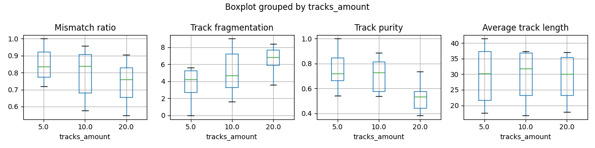

# Object Tracking Home assignment

## Отчет

### Установка и Воспроизводимость
Для установки окружения используется `poetry`:
```bash
poetry shell
poetry install
```
Для запуска web сервера используется следующая команда
```bash
poetry run uvicorn fastapi_server:app --reload --port 8001
```

Для эвалюации трекеров и сохранения репортов с метриками используется следующая команда
```bash
poetry run evaluation.py
```

### Редактирование кода

Перед началом выполнения заданий мы отредактровали и улучшили уже существовавший код:

- Улучшена воспроизводимость кода, используя менеджер окружения `poetry`
- Исправлена стилистика кода, с использованием `ruff`
- Добавлены endpoint'ы fastapi, чтобы можно было смотреть на веб-страницу с отображением результатов работы алгоритмов
- Отредактирован модуль `create_track.py` -- была добавлена возможность динамически создавать различные траектории без
  ручного переноса в `.py` файлы, как это было раньше
- Трекеры были вынесены в отдельный модуль, что облегчило восприятение серверной части

### Трекеры и Метрики

Были реализованы `soft` и `strong` трекеры, а также реализованы метрики эвалюации данных трекеров. Хоть визуально
строить метрики для отдельных тракеторий и получать метрики используя web приложение в `fastapi_server` мы реализовали
модуль `evaluate.py`, в котором считали метрики для различных входных параметров траекторий и для различных трекеров. Далее метрики для каждого запуска, а также визуализация статистических данных автоматически сохранялись в `.md` файлы:
[Soft metrics](metrics_report_soft.md) и
[Strong metrics](metrics_report_strong.md). Для удобства, мы продублируем их здесь тоже:

### Soft Tracker

|    |   tracks_amount |   random_range |   bb_skip_percent |   Average track coverage |   Mismatch ratio |
|---:|----------------:|---------------:|------------------:|-------------------------:|-----------------:|
|  0 |               5 |              0 |              0    |                    1     |            1     |
|  1 |               5 |              0 |              0.05 |                    0.555 |            0.814 |
|  2 |               5 |              0 |              0.25 |                    0.564 |            0.926 |
|  3 |               5 |              0 |              0.5  |                    0.529 |            0.684 |
|  4 |               5 |             10 |              0    |                    0.995 |            0.995 |
|  5 |               5 |             10 |              0.05 |                    0.876 |            0.968 |
|  6 |               5 |             10 |              0.25 |                    0.615 |            0.87  |
|  7 |               5 |             10 |              0.5  |                    0.708 |            0.747 |
|  8 |              10 |              0 |              0    |                    0.824 |            0.978 |
|  9 |              10 |              0 |              0.05 |                    0.69  |            0.95  |
| 10 |              10 |              0 |              0.25 |                    0.593 |            0.734 |
| 11 |              10 |              0 |              0.5  |                    0.477 |            0.597 |
| 12 |              10 |             10 |              0    |                    0.887 |            0.959 |
| 13 |              10 |             10 |              0.05 |                    0.647 |            0.842 |
| 14 |              10 |             10 |              0.25 |                    0.561 |            0.706 |
| 15 |              10 |             10 |              0.5  |                    0.437 |            0.58  |
| 16 |              20 |              0 |              0    |                    0.622 |            0.891 |
| 17 |              20 |              0 |              0.05 |                    0.597 |            0.817 |
| 18 |              20 |              0 |              0.25 |                    0.408 |            0.625 |
| 19 |              20 |              0 |              0.5  |                    0.482 |            0.55  |
| 20 |              20 |             10 |              0    |                    0.653 |            0.854 |
| 21 |              20 |             10 |              0.05 |                    0.608 |            0.848 |
| 22 |              20 |             10 |              0.25 |                    0.424 |            0.713 |
| 23 |              20 |             10 |              0.5  |                    0.39  |            0.575 |





### Strong Tracker

|    |   tracks_amount |   random_range |   bb_skip_percent |   Average track coverage |   Mismatch ratio |
|---:|----------------:|---------------:|------------------:|-------------------------:|-----------------:|
|  0 |               5 |              0 |              0    |                    0.484 |            0.745 |
|  1 |               5 |              0 |              0.05 |                    0.713 |            0.834 |
|  2 |               5 |             10 |              0    |                    0.683 |            0.864 |
|  3 |               5 |             10 |              0.05 |                    0.628 |            0.828 |
|  4 |              10 |              0 |              0    |                    0.517 |            0.749 |
|  5 |              10 |              0 |              0.05 |                    0.615 |            0.861 |
|  6 |              10 |             10 |              0    |                    0.558 |            0.795 |
|  7 |              10 |             10 |              0.05 |                    0.675 |            0.858 |


### Установка зависимостей

```
pip install -r requirements.txt
```

### Запуск сервера

Или настройте запуск файла fastapi_server.py как приведено на скриншоте ниже


или командой в терминале

```
python3 -m uvicorn fastapi_server:app --reload --port 8001 
```

### Постановка задачи

Реализуйте методы tracker_soft и tracker_strong в скрипте fastapi_server.py,
придумайте, обоснуйте и реализуйте метод для оценки качества разработанных трекеров.
Сравните результаты tracker_soft и tracker_strong для 5, 10, 20 объектов и различных
значений random_range и bb_skip_percent
(информацию о генерации данных читай в пункте "Тестирование"). Напишите отчёт.
В отчете необходимо в свободном стиле привести описание методов tracker_soft,
tracker_strong, метода оценки качества трекеров, привести сравнительную таблицу
реализованных трекеров, сделать вывод.  
Бонусом можете выписать найденные баги в текущем проекте.

### Тестирование

Для тестирования можно воспользоваться скриптом create_track.py. Скрипт генерирует
информацию об объектах и их треках. Скопируйте вывод в новый скрипт track_n.py и
скорректируйте импорт в fastapi_server.py

```
from track_n import track_data, country_balls_amount
```

Что стоит менять в скрипте create_track.py:  
**tracks_amount**: количество объектов  
**random_range**: на сколько пикселей рамка объектов может ложно смещаться (эмуляция не идеальной детекции)  
**bb_skip_percent**: с какой вероятностью объект на фрейме может быть не найдет детектором  