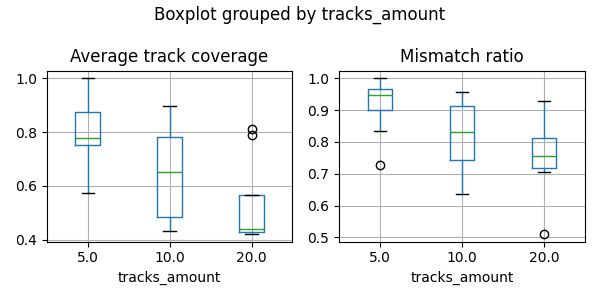
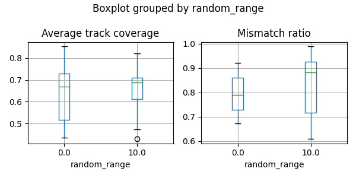
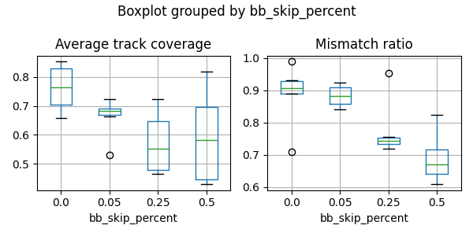

|    |   tracks_amount |   random_range |   bb_skip_percent |   Average track coverage |   Mismatch ratio |
|---:|----------------:|---------------:|------------------:|-------------------------:|-----------------:|
|  0 |               5 |              0 |              0    |                 0.852556 |         0.708995 |
|  1 |               5 |              0 |              0.05 |                 0.530285 |         0.84106  |
|  2 |               5 |              0 |              0.25 |                 0.620937 |         0.748092 |
|  3 |               5 |              0 |              0.5  |                 0.697864 |         0.732558 |
|  4 |               5 |             10 |              0    |                 0.821441 |         0.989071 |
|  5 |               5 |             10 |              0.05 |                 0.723927 |         0.924419 |
|  6 |               5 |             10 |              0.25 |                 0.721942 |         0.953488 |
|  7 |               5 |             10 |              0.5  |                 0.687879 |         0.63     |
|  8 |              10 |              0 |              0    |                 0.830334 |         0.921569 |
|  9 |              10 |              0 |              0.05 |                 0.677374 |         0.916409 |
| 10 |              10 |              0 |              0.25 |                 0.47765  |         0.755245 |
| 11 |              10 |              0 |              0.5  |                 0.818093 |         0.823529 |
| 12 |              10 |             10 |              0    |                 0.705645 |         0.930818 |
| 13 |              10 |             10 |              0.05 |                 0.689371 |         0.88141  |
| 14 |              10 |             10 |              0.25 |                 0.656559 |         0.737643 |
| 15 |              10 |             10 |              0.5  |                 0.47452  |         0.67052  |
| 16 |              20 |              0 |              0    |                 0.658031 |         0.891892 |
| 17 |              20 |              0 |              0.05 |                 0.692743 |         0.850077 |
| 18 |              20 |              0 |              0.25 |                 0.465007 |         0.719298 |
| 19 |              20 |              0 |              0.5  |                 0.435365 |         0.671598 |
| 20 |              20 |             10 |              0    |                 0.704092 |         0.889628 |
| 21 |              20 |             10 |              0.05 |                 0.66458  |         0.884273 |
| 22 |              20 |             10 |              0.25 |                 0.482225 |         0.731532 |
| 23 |              20 |             10 |              0.5  |                 0.430611 |         0.60961  |

