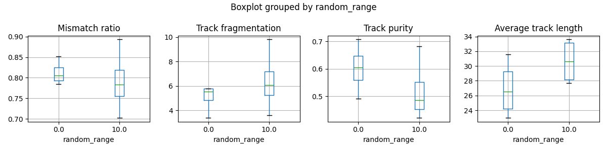
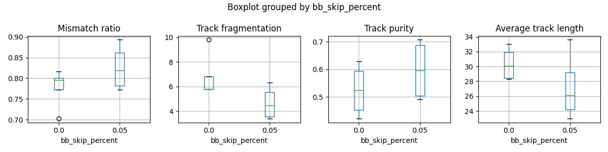

|    |   tracks_amount |   random_range |   bb_skip_percent |   Average track coverage |   Mismatch ratio |
|---:|----------------:|---------------:|------------------:|-------------------------:|-----------------:|
|  0 |               5 |              0 |              0    |                    0.484 |            0.745 |
|  1 |               5 |              0 |              0.05 |                    0.713 |            0.834 |
|  2 |               5 |             10 |              0    |                    0.683 |            0.864 |
|  3 |               5 |             10 |              0.05 |                    0.628 |            0.828 |
|  4 |              10 |              0 |              0    |                    0.517 |            0.749 |
|  5 |              10 |              0 |              0.05 |                    0.615 |            0.861 |
|  6 |              10 |             10 |              0    |                    0.558 |            0.795 |
|  7 |              10 |             10 |              0.05 |                    0.675 |            0.858 |

